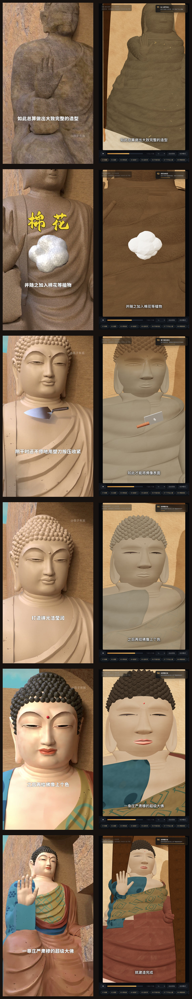
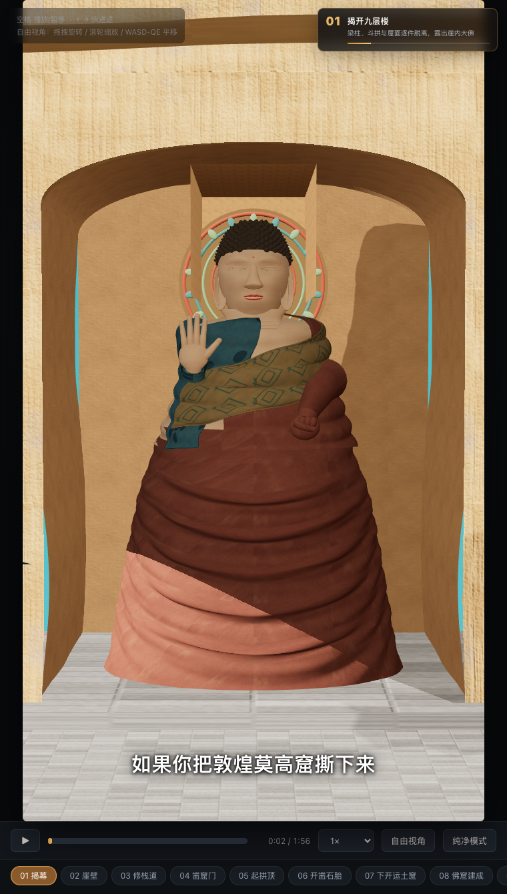

# 真实 3D 佛像实现与验收

## 结论

本轮在 Round 2 的 116.373 秒时间轴和 9:16 构图上，重建了佛像近景。头部、五官、颈部、双手、螺发、衣袖、袈裟和衣褶均由 WebGL 实体网格实时渲染，不使用人物照片、Sprite 或 PlaneGeometry 人物替身。程序化 Canvas/PBR 纹理仅提供泥层、石胎、肤彩和织物的颜色、粗糙度及微法线。

工程与真实三维门禁通过；视觉比恢复后的 Round 2 基线明显更立体，并加入参考片中的施无畏手势、贴身袈裟、螺发、敷泥和上彩阶段。它仍是程序化建模，不是摄影测量、扫描或专业数字雕刻资产，因此不能诚实声称与原片达到数学意义上的 100% 一致。

## 三维实现证据

- 佛像升级组：`RealThreeDimensionalBuddhaUpgrade`
- 几何契约：`volumetric-surfaces-with-normals-no-impostors`
- 人物图片替身：无
- 实体曲面网格：65 个，另有 1 个 InstancedMesh
- 螺发：301 个三维实例
- 佛像升级组渲染三角形：903,978
- 完整关键帧渲染三角形：1,125,788
- 头部：221,184 个三角形
- 面部组件：19 个三维曲面网格，31,592 个三角形
- 举起的右手：11,292 个三角形
- 放置的左手：4,752 个三角形
- 正面、左 25°、右 25° 截图哈希均不同；两两变化像素比例为 33.16%、35.14% 和 44.41%，证明轮廓与遮挡会随相机真实变化。

完整机器报告见 [`real-3d-buddha-report.json`](evidence/real-3d-buddha-report.json)。

## 参考片逐帧对照

下图每行左侧为参考视频，右侧为网页实时渲染，时间点依次为 72、80、88、91、93、95 秒。

参考视频：

- 时长：116.373 秒
- 分辨率：1080 × 1920
- SHA-256：`bd0a346b84117ddd3fda3f267de5ebeccb95ccaebc1125e312dbf08421cb5df3`
- 原视频未复制到仓库，也未嵌入页面。

## 独立门禁结果

以下项目均在最终构建上实际执行通过：

- 所有源码、构建脚本和验收脚本通过 `node --check`
- 两种构建入口生成的 HTML 逐字节一致
- 页面默认暂停在第一章 2.5 秒的佛像预览；首次点击播放或“01 揭幕”会回到 0 秒完整播放
- 16 个章节与 16 个关键时间点完整
- 点击章节只播放当前段，并在下一章节边界自动暂停
- 播放/暂停、2 倍速、进度跳转和自由视角通过
- 无 `<video>` 元素、无运行时远程请求、无页面错误
- 390 × 844 移动窗口适配通过
- 604 × 816、DPR2 窄窗口适配通过；画布 CSS 为 403 × 717，backing buffer 为 604 × 1075
- 三维网格具备 position 与 normal；佛像升级组无 Sprite、无 PlaneGeometry
- 三个相机视角产生可验证的真实视差

浏览器报告见 [`final-browser-report.json`](evidence/final-browser-report.json)。

默认首屏的真实浏览器截图如下；佛像完整可见，页面仍处于暂停状态。

## 最终文件

- `index.html`：1,585,145 bytes
- `敦煌莫高窟大佛建造全过程.html`：1,585,145 bytes
- 两个文件逐字节一致
- SHA-256：`d9ee5df2fb03aaedda25823921c91e957b51fd67791631a21881b3e14fb90918`

## 已知视觉边界

- 面相、肌肤细节、衣纹重力感和矿物颜料旧化仍能看出程序化建模痕迹，未达到扫描级数字文物精度。
- 门禁证明人物由有厚度、可产生遮挡和视差的三维曲面构成，但没有执行 manifold/watertight 拓扑证明；因此不把全部衣片夸大为严格水密闭合体。
- 自动门禁可以证明真实三维、交互正确、离线和可复现，但不能客观证明“非常惊艳”或“100% 一样”这类主观标准。
- 当前测试覆盖 Chromium/WebGL；未覆盖所有 Safari、移动 GPU 和低端设备。
